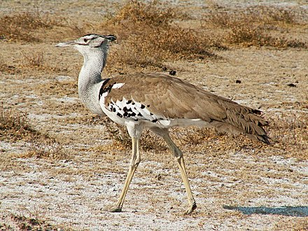

# Kori

[](https://npm.im/kori)

a simple route parser;

## what is kori?

[The kori bustard (*Ardeotis kori*) is arguably the largest flying bird native to Africa.](https://en.wikipedia.org/wiki/Kori_bustard)



## how to use it?

```javascript
const Kori = require('kori');
// or
import Kori from 'kori';

const kori = new Kori();

const controller = (ctx, ...args) => {
  console.log({ctx, args});
};

kori.get('/app/a/b', controller)
.get('/app/*', controller)
.post('/app/user/{id}', controller);

kori.handle('https://test.com/app/a/b','GET', 1, 2, 3);
kori.handle('/app/c/b', 'get', 4);
kori.handle('https://test.com/app/user/123', 'POST');
```

support methods: 

```javascript
const methods = [
  'get', 'post', 'put', 'head', 'delete',
  'options', 'trace', 'copy', 'lock', 'mkcol',
  'move', 'purge', 'propfind', 'proppatch', 'unlock',
  'report', 'mkactivity', 'checkout', 'merge', 'm-search',
  'notify', 'subscribe', 'unsubscribe', 'patch', 'search', 'connect',
];
```